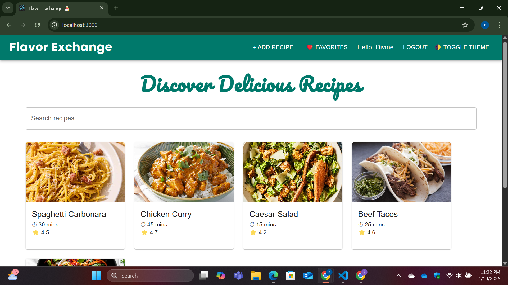
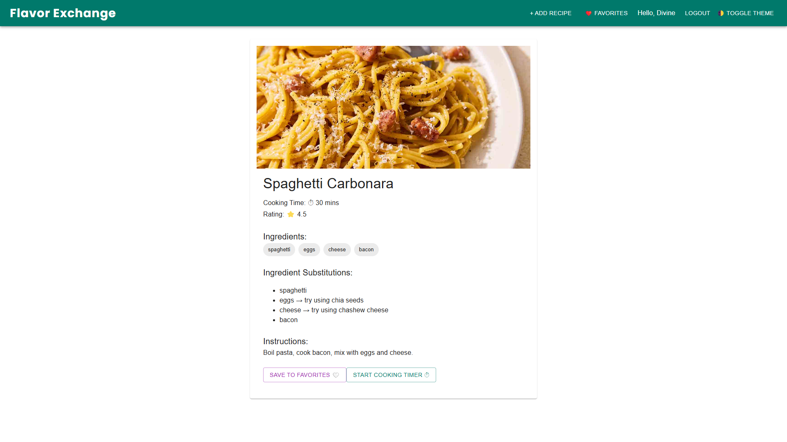

# 🍽️ Flavor Exchange - Recipe Sharing Platform

A modern React-based web application that lets users browse, add and save their favorite recipes. Built as part of a Intern Front-End assignment.





---

## 🚀 Features

- 📄 **Recipe Feed** – View all available recipes with search functionality.
- 🔍 **Search Recipes** – Filter recipes by title or ingredient.
- 👤 **Mock Login/Logout** – Lightweight authentication using local storage.
- 💾 **Save Favorites** – Users can save or remove recipes from their favorites.
- ➕ **Add/Edit/Delete Recipes** – Authenticated users can manage their own recipes.
- 🌓 **Dark Mode Toggle** – Switch between light and dark theme.
- ⏱ **Cooking Timer** – Start a countdown based on cooking time.
- 🔁 **Ingredient Substitutions** – Suggested alternatives for common ingredients.
- ❤️ **Favorites Page** – View all recipes you've marked as favorite.

---

## 🛠️ Tech Stack

- **React**
- **React Router**
- **Redux Toolkit**
- **Material UI**
- **JSON Server** (for mock API)
- **Local Storage** (for auth + favorites)

---

## 🧪 How to Run Locally

### 1. Clone the repos

```bash
git clone https://github.com/IT21915840/flavor-exchange.git
cd flavor-exchange

### 2. Install dependencies

npm install

### 3. Start mock API

npx json-server --watch db.json --port 3001

### 4. Start the App

npm start

